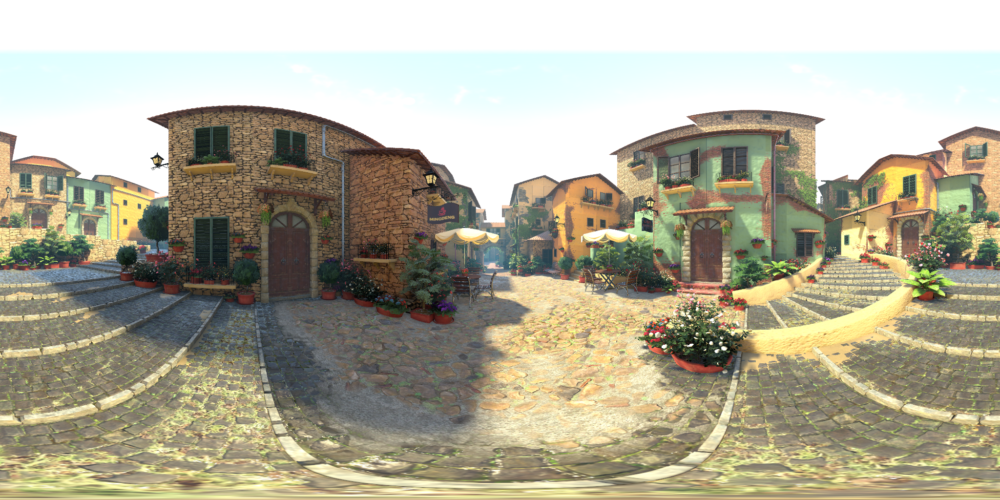
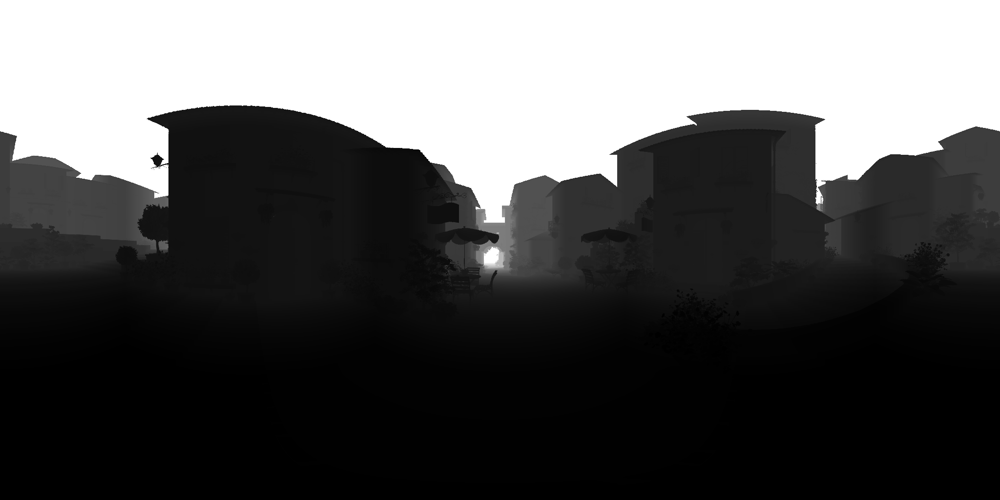

# Capture panorama images by AirSim

I have made a [modified version of AirSim][modified_airsim] so that we could capture panorama RGB images and depth images.

[modified_airsim]: https://github.com/huyaoyu/AirSim

This repo has the sample code for testing the modified AirSim.

Please see [my blog on how I implement the modifications](http://www.huyaoyu.com/technical/2021/04/29/modify-airsim.html).




# Note for "depth" v.s. "distance"

By default, the modified AirSim generates "depth" panorama images. Since "depth" is defined by referencing the individual faces of the rendered cube, the pixels in the depth panorama image will have different reference directions according to the pixel coordinates. If you need "distance" instead of "depth", you have to convert the rendered depth panorama into the distance version. I have provided a sample script to do just that and the run.py script already utilizes the conversion. See [depth_2_distance.py](https://github.com/huyaoyu/AirSim_SampleCubeClient/blob/56b2742f5330170e5bc405b9be4fc1ae6027f33a/cube/depth_2_distance.py#L57) for more detail. The [`numba`](https://numba.readthedocs.io/en/stable/index.html) package is required for depth-distance conversion.

# Version info

Use the `Cube` branch of the [modified AirSim][modified_airsim].

The modified AirSim is based on the 1.4.0 (1.6) version. I have tested it with Unreal Engine 4.26.2. There might be some issues when converting a project that is created by the 4.25 version. 

If this happens, let Unreal Engine generate the project files and use Visual Studio Code to compile the Development Editor configuration. If Unreal Engine refuses to generate the project files, I believe the following command is the one to try.

```bash
/UnrealEngine/Engine/Binaries/DotNET/UnrealBuildTool.exe -projectfiles -vscode -project=/path/to/your/unreal/project.uproject -game -engine
```

Then open the Visual Studio Code project and select the `Terminal->Run Build Task` menu entry. Then type "editor development" to search for Build commands.

# How to run

Configure the `settings.json` used by AirSim by adding `CaptureSettings` for the new image type. Image type 8 is RGB and type 9 is depth.

```json
"SimMode": "ComputerVision",
"CameraDefaults": {
    "CaptureSettings": [
        {
            "ImageType": 8,
            "Width": 1024,
            "Height": 1024,
        },
        {
            "ImageType": 9,
            "Width": 1024,
            "Height": 1024,
        }
    ]
}
```

Start a ~~game~~simulation using the AirSimGameMode. Go to the `cube` directory and run `python run.py`.

Enjoy!
